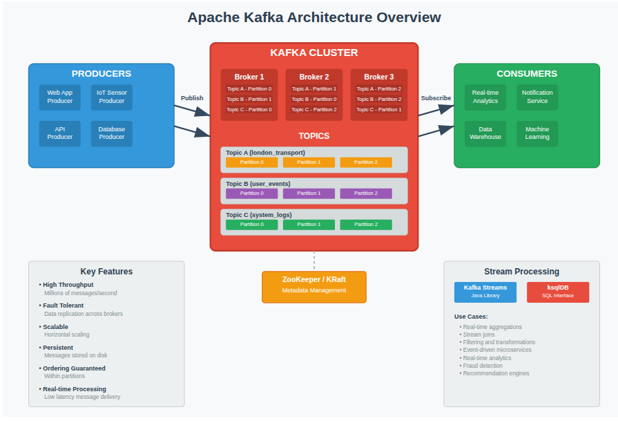

# Apache Kafka Deep Dive: Core Concepts, Data Engineering Applications, and Real-World Production Practices

## 1. Introduction
In today's digital landscape, organizations generate and consume massive streams of data from a variety of sources: mobile devices, sensors, applications, social networks, and more. Traditional batch-oriented processing frameworks are not sufficient to handle the demands of real-time decision-making, monitoring, and analytics. To bridge this gap, Apache Kafka has emerged as a leading distributed event streaming platform.

Kafka was originally developed at LinkedIn in 2010 to address scalability issues with log processing pipelines. In 2011, it was open-sourced and has since become a top-level Apache project. Its core design principles of scalability, fault tolerance, and high-throughput messaging have made it a cornerstone of modern data engineering. Today, companies like Netflix, Uber, and LinkedIn depend on Kafka for mission-critical, real-time data pipelines.

This article provides a deep dive into Kafka's core concepts, explains its role in data engineering, and explores production use cases in large-scale enterprises. We will also walk through a hands-on streaming project using the Transport for London (TfL) API integrated with Confluent Cloud.



*Cited: [Apache Kafka Documentation](https://kafka.apache.org/documentation/), Kreps et al. (2011), Confluent Blog.*

## 2. Core Concepts of Apache Kafka
At its heart, Kafka is a publish-subscribe messaging system optimized for distributed, high-volume data streams. Its architecture introduces several key building blocks:

### 2.1 Topics and Partitions
A topic is a named stream of records. Data in Kafka is always published to topics. Each topic is divided into partitions, which provide parallelism and fault tolerance. Partitioning enables Kafka to handle billions of events per day by distributing load across multiple brokers.
- Example: A topic called `london_transport` may have 6 partitions, allowing parallel processing of bus arrival events.
- Partition assignment also ensures ordering guarantees within a single partition.

### 2.2 Producers and Consumers
- **Producers** write events into Kafka topics. They are responsible for deciding which partition an event belongs to (either round-robin, hash-based on keys, or custom logic).
- **Consumers** subscribe to topics and read events. Kafka consumers can work independently or as part of a consumer group. In a group, partitions are distributed among consumers for scalability.

### 2.3 Brokers and Clusters
A **Kafka broker** is a server that stores and serves messages. Multiple brokers form a **cluster**. Each broker handles partition replicas to ensure high availability. Kafka also uses **ZooKeeper** (being replaced by KRaft mode in newer versions) for metadata management.

### 2.4 Offsets and Reliability
Kafka ensures that consumers can track their position in a partition via an **offset**. This allows:
- Replay of messages (useful for debugging and recovery).
- Exactly-once or at-least-once processing semantics.

### 2.5 Stream Processing 
Beyond messaging, Kafka enables real-time processing via two main APIs:
- **Kafka Streams** (A Java library for stateful processing).
- **ksqlDB** (a SQL-like interface to process Kafka data declaratively).


*Cited: [Kafka Concepts Guide](https://kafka.apache.org/documentation/#introduction), Confluent Kafka 101 series.*

## 3. Kafka in Data Engineering
Kafka has become a foundational component of modern data engineering pipelines. It acts as the "central nervous system" of data infrastructure, enabling continuous data flows between systems.

### 3.1 Data Ingestion
Kafka serves as the front door for ingesting data from diverse sources:
- APIs (e.g., weather, finance, transport).
- Application logs.
- IoT device telemetry.
- Databases (via Kafka Connect connectors)

The TfL bus arrival example illustrates how an external API can stream data into Kafka topics in real time. A **Python producer** polls the API and pushes structured JSON records into the `london_transport` topic.

### 3.2 Data Processing
Once ingested, Kafka provides multiple options for processing streams:
- **Kafka Streams** for building stateful transformations such as aggregations or joins.
- **ksqlDB** for declarative, SQL-like filtering (e.g., only buses going to "Victoria" within 10 minutes).
- **Integration with external processors** such as Apache Flink, Spark, or cloud services.

### 3.3 Data Storage and Serving
Processed data can be routed downstream using **sink connectors** to:
- Data warehouses (Snowflake, BigQuery, Redshift).
- Search engines (Elasticsearch).
- Storage systems (S3, HDFS, Azure Blob).

This makes Kafka a central event hub for both operational and analytical systems.


*Cited: Confluent Engineering Blog, "Kafka as the Central Nervous System of Data."*

## 4. Hands-On Walkthrough: Streaming Real-Time Data
One of the most effective ways to understand Kafka's capabilities is through a real-world integration. In this walkthrough, I demonstrate how to stream live **London bus arrival data** from the **Transport for London (TfL) API** into **Confluent Cloud**, and then consume and query that data in real time.

### 4.1 Setting up Kafka/Confluent Cloud
Before writing any code, I need a running Kafka environment. Confluent Cloud provides a fully managed Kafka cluster, eliminating the need for manual broker configuration.

Steps:
1. Log into [Confluent Cloud](https://confluent.cloud/) and create a new **Kafka cluster**.
2. Create a **topic** called `london_transport`.
3. Download the project folder or open in VS Code after setting up the language and `client.properties` credentials from Confluent Cloud.


### 4.2 Writing a Python Producer
My producer (`producer.py`) connects to the TfL API, retrieves live bus arrivals, and sends them into Kafka. The API provides an endpoint like:
`https://api.tfl.gov.uk/StopPoint/{STOP_ID}/Arrivals?app_key={API_KEY}`

A simplified version of the producer code:
```python
from confluent_kafka import Producer
import requests
import json
import time

def read_config():
    # reads the producer configuration from client.properties
    # and returns it as a key-value map
    config = {}
    with open("client.properties") as fh:
        for line in fh:
            line = line.strip()
            if len(line) != 0 and line[0] != "#":
                parameter, value = line.strip().split('=', 1)
                config[parameter] = value.strip()
    return config

def get_bus_arrivals(stop_id, app_key):
    # fetches bus arrival data from the TfL API
    url = f"https://api.tfl.gov.uk/StopPoint/{stop_id}/Arrivals?app_key={app_key}"
    response = requests.get(url)
    return response.json()

def produce(topic, config, stop_id, app_key):
    # creates a new producer instance
    producer = Producer(config)

    try:
        while True:
            # fetches bus arrival data
            arrivals = get_bus_arrivals(stop_id, app_key)

            for bus in arrivals:
                if isinstance(bus, dict):  # ensure it's a dictionary
                    key = bus.get("lineId", "unknown")
                    value = json.dumps(bus)
                    producer.produce(topic, key=key, value=value)
                    print(f"Produced message to topic {topic}: key = {key}, destination={bus.get('destinationName', '')}")
                else:
                    print("Unexpected data type from TfL API:", bus)
            # send any outstanding or buffered messages to the Kafka broker
            producer.flush()
            # wait for 60 seconds before fetching new data
            time.sleep(60)
    except KeyboardInterrupt:
        pass

if __name__ == "__main__":
    config = read_config()
    topic = "london_transport"
    stop_id = "490000254W"
    app_key = "4e209d567ba44f97b338ad3d7f2bdf4c"

    produce(topic, config, stop_id, app_key)
```
When executed, the producer continuously publishes JSON records (each representing a bus arrival) into the Kafka topic.


### 4.3 Consuming Data
On the other side, a **Kafka consumer** (`consumer.py`) reads from the `london_transport` topic.
```python
from confluent_kafka import Consumer

def read_config():
    # reads the consumer configuration from client.properties
    # and returns it as a key-value map
    config = {}
    with open("client.properties") as fh:
        for line in fh:
            line = line.strip()
            if len(line) != 0 and line[0] != "#":
                parameter, value = line.strip().split('=', 1)
                config[parameter] = value.strip()
    return config

def consume(topic, config):
    config["group.id"] = "london_transport_group"
    config["auto.offset.reset"] = "earliest"

    # creates a new consumer instance
    consumer = Consumer(config)
    consumer.subscribe([topic])

    try:
        while True:
            msg = consumer.poll(1.0)
            if msg is not None and msg.error() is None:
                key = msg.key().decode("utf-8") if msg.key() else "null"
                value = msg.value().decode("utf-8") if msg.value() else "null"
                print(f"Consumed message from {topic}: key={key}, value={value}")
    except KeyboardInterrupt:
        pass
    finally:
        consumer.close()

if __name__ == "__main__":
    config = read_config()
    topic = "london_transport"
    consume(topic, config)
```
Running this consumer displays the real-time stream of events from the TfL API via Kafka.


### 4.4 Querying with ksqlDB
To further explore the data, Confluent provides **ksqlDB**, which allows SQL-like queries over Kafka topics. 
```sql
SELECT * 
FROM `default`.`cluster_0`.`london_transport`
LIMIT 5;
```
Examining raw data structure.
*Not good practice to select all*


## 5. Real-World Use Cases of Apache Kafka
Kafka's strength lies not just in its technical design but in its widespread adoption across industries. From social networks to ride-hailing platforms and financial services, Kafka has become the backbone for real-time data processing.

### 5.1 LinkedIn: Real-Time Activity Feeds
Kafka was originally born at LinkedIn to address challenges with scaling activity streams and operational data pipelines. Today, LinkedIn uses Kafka to power:

- Activity feeds (profile views, likes, shares).
- Log aggregation across microservices.
- Operational metrics to monitor platform health.

LinkedIn's Kafka deployment spans trillions of messages per day, making it one of the largest and most mature streaming infrastructures in the world (Kreps et al., 2011).

*Cited: Kreps, J., Narkhede, N., & Rao, J. (2011). Kafka: a Distributed Messaging System for Log Processing. LinkedIn.*

### 5.2 Case Study: A Kenyan Tier 1 Bank
In Kenya, Tier 1 banks like KCB Group and Equity Bank handle millions of digital transactions daily through mobile money (M-Pesa integration), online banking, and agency networks. These institutions face unique challenges:
- **Mobile-first customer base** with high transaction volumes.
- **Integration with fintechs** and mobile network operators.
- **Regulatory oversight** from the Central Bank of Kenya (CBK).

By leveraging Kafka, a Kenyan Tier 1 Bank can:
- Stream mobile transactions in real-time for fraud detection.
- Provide real-time customer notifications (SMS/USSD) for deposits, withdrawals, or loans.
- Enable seamless integration with M-Pesa APIs, ensuring that money moves between wallets and bank accounts without lag.
- Build analytics dashboards for branch and agent performance, powered by Kafka + ksqlDB.

*Cited: Confluent Blog – "Kafka in Banking and Financial Services"; CBK reports on digital banking adoption.*

## 6. Conclusion
Apache Kafka has proven itself as more than just a messaging system; it is the backbone of real-time data infrastructures across industries. From powering LinkedIn's social feeds to enabling fraud detection and mobile payments in Kenyan banks, Kafka continues to redefine how data is captured, processed, and acted upon at scale.

Through the hands-on example of streaming bus arrivals from the TfL API into Confluent Cloud, we saw how easy it is to build a practical real-time pipeline: fetching external data, publishing it into a Kafka topic, consuming the events, and querying them with ksqlDB. Screenshots of the producer, consumer, and Confluent UI further illustrate that Kafka is not just theoretical—it is accessible to practitioners and learners today.

In conclusion, mastering Kafka equips engineers and organizations with a powerful tool to bridge the gap between raw data and actionable insights, making real-time decision-making a reality, whether it's routing a bus in London, recommending a movie on Netflix, or securing a mobile money transaction in Nairobi.